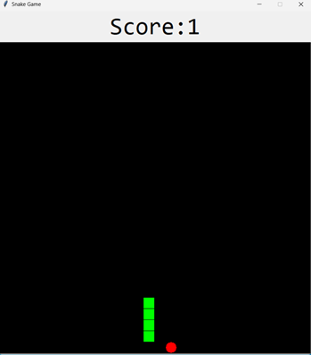
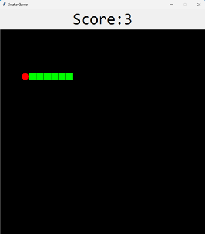
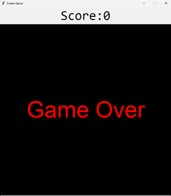

# Proiect: Jocul "Snake" în Python

**Autor:** Cosma Andrei  
**Facultatea:** FSA-UNSTPB  
**Grupa:** 1342a  

---

## 1. Introducere
Acest proiect reprezintă o implementare a jocului clasic **Snake** folosind limbajul de programare **Python** și biblioteca grafică **Tkinter**. Scopul jocului este de a controla un șarpe care se mișcă pe ecran, colectând hrană pentru a crește în dimensiune, evitând în același timp coliziunile cu pereții sau cu propriul corp.

## 2. Funcționalități principale
* **Interfață Grafică (GUI):** Utilizarea modulului `tkinter` pentru randarea ferestrei și a elementelor de joc.
* **Mecanica de joc:** Mișcarea continuă a șarpelui controlată prin tastele direcționale (Săgeți).
* **Sistem de scor:** Incrementarea scorului la fiecare bucată de mâncare consumată.
* **Detecția coliziunilor:** Jocul se termină automat în cazul în care șarpele atinge marginile ferestrei sau propriul corp.

## 3. Arhitectura Codului

### Clase Principale
Proiectul este structurat în jurul a două clase principale care gestionează entitățile jocului:

* **`class Snake`**: Inițializează corpul șarpelui, gestionează coordonatele și randează pătrățelele care formează șarpele pe `canvas`.
* **`class Food`**: Generează aleatoriu poziția hranei pe ecran, asigurându-se că aceasta nu se suprapune cu șarpele (în logica de bază).

### Logica de joc (Game Loop)
Funcția `next_turn` reprezintă "inima" jocului. Aceasta este apelată recursiv folosind `window.after(SPEED, ...)` pentru a crea bucla de joc.

```python
def next_turn(snake, food):
    snake.coordinates.insert(0, (x, y))

    square = canvas.create_rectangle(x, y, x + SPACE_SIZE, y + SPACE_SIZE, fill=SNAKE_COLOR)

    snake.squares.insert(0, square)

    if x == food.coordinates[0] and y == food.coordinates[1]:
        global score

        score += 1

        label.config(text="Score:{}".format(score))
        canvas.delete("food")
        food = Food()
    else:
        del snake.coordinates[-1]
        canvas.delete(snake.squares[-1])
        del snake.squares[-1]

    if check_collisions(snake):
        game_over()
    else:
        window.after(SPEED, next_turn, snake, food)
```

## 4. Capturi de Ecran

<h1>Imagini din timpul jocului</h1>
<p>
  
  
</p>
<h3>Imagine cu ecranul Game Over</h3>
<p>
      
</p>

## 5. Instrucțiuni de Rulare
Pentru a rula acest proiect, asigurați-vă că aveți instalat Python.

1.  Copiați codul sursă într-un fișier cu extensia `.py` (ex: `snake_game.py`).
2.  Deschideți un terminal sau un command prompt.
3.  Navigați către directorul unde ați salvat fișierul.
4.  Executați comanda:
    ```bash
    python snake_game.py
    ```

## 6. Concluzii
Acest proiect a demonstrat utilizarea conceptelor de programare orientată pe obiecte (POO) în Python și lucrul cu interfețe grafice simple. Este o bază excelentă pentru extinderi ulterioare, cum ar fi:
* Adăugarea unor nivele de dificultate (creșterea vitezei).
* Salvarea scorului maxim într-un fișier extern.
* Adăugarea de sunete sau efecte vizuale.